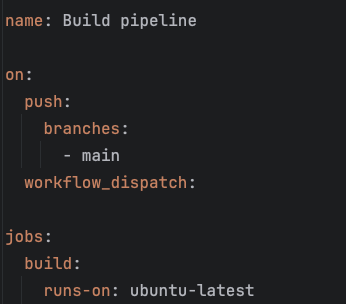

# GITHUB Actions

In this codelab we will create a github Action workflow

### Start
Lets begin by creating a new github repository for which a new project will be made. This project exposes an endpoint returning something 
(anything you want, we're flexible like that) and also a test that verifies the output of that endpoint.
Once that is done push this new project to your repository.

### Workflow file
#### Creation 
Create under your project directory the directory `.github/workflows` (this will let github detect your pipeline).

Here you should create a file with extension `.yaml` (or `.yml`) the name of the file doesn't matter, but we'll call it pipeline.yaml.

We need to provide at least 3 properties in this file
- `name`: The name of your workflow (doesn't need to be the same as the filename)
- `on`: Specifies the events that trigger the workflow.
- `jobs`: Defines one or more jobs to run in parallel. These jobs are executed on Github hosted runners (virtual machines) 
with pre-installed software including JDK's and Maven 

your file should look something like this



This specifies a workflow with build pipeline as its name and will trigger when a commit is pushed to the main branch or
triggered manually in github UI with `workflow_dispatch` property. Lastly it specifies to run on ubuntu distro

#### Steps
The above workflow doesn't do much. The goal is to compile and run our code against the test.
The first step for this process will be to check out our code to the runner. Copy the code below and paste it below `runs-on: ubuntu-latest`:

```yaml
steps: 
  - name: Checkout code
    uses: actions/checkout@v4
```

Next up is to setup our JDK
```yaml
  - name: Set up JDK 17
    uses: actions/setup-java@v3
    with:
      distribution: 'adopt'
      java-version: '17'
```

Final step or steps if you want to split up compilation and testing
```yaml
  - name: Compile and/or test our code
    run: 'Replace this with a command' (hint something with maven)
```

If you provided these 3 different steps then you can push your changes.

And if you did everything correct this push should start your first CI pipeline!
Go to Github repository and check out the actions tab

#### Checking your workflow run
Now we'll add a second test, but this time and only this time you're allowed to push a failing test to your main branch.
Again this should trigger a new run op your workflow but this time it will fail. Go through the UI to see if you can find the failing test.

Armed with the information from the run you can fix this red test back to nice green one.